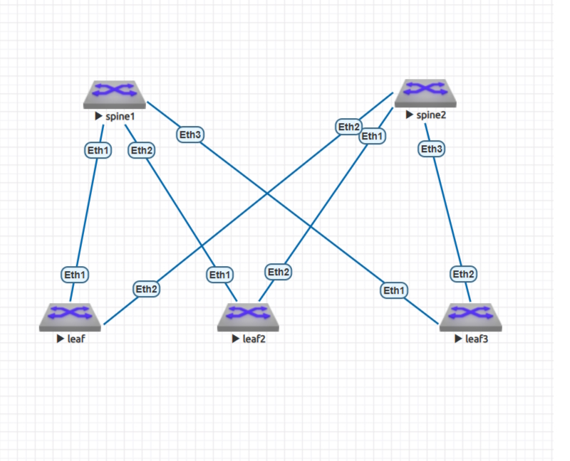
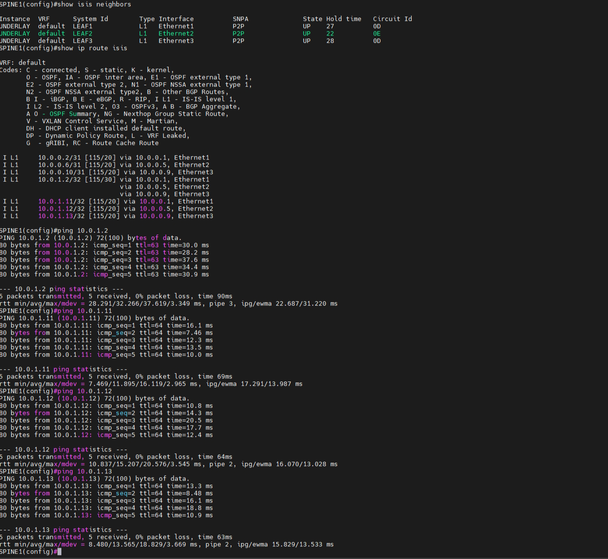
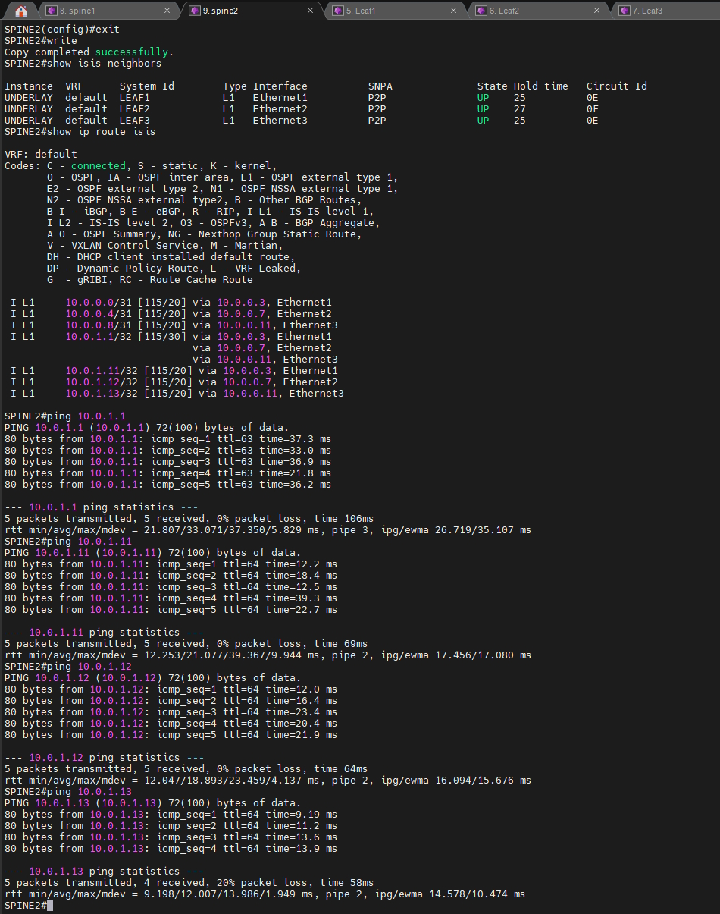
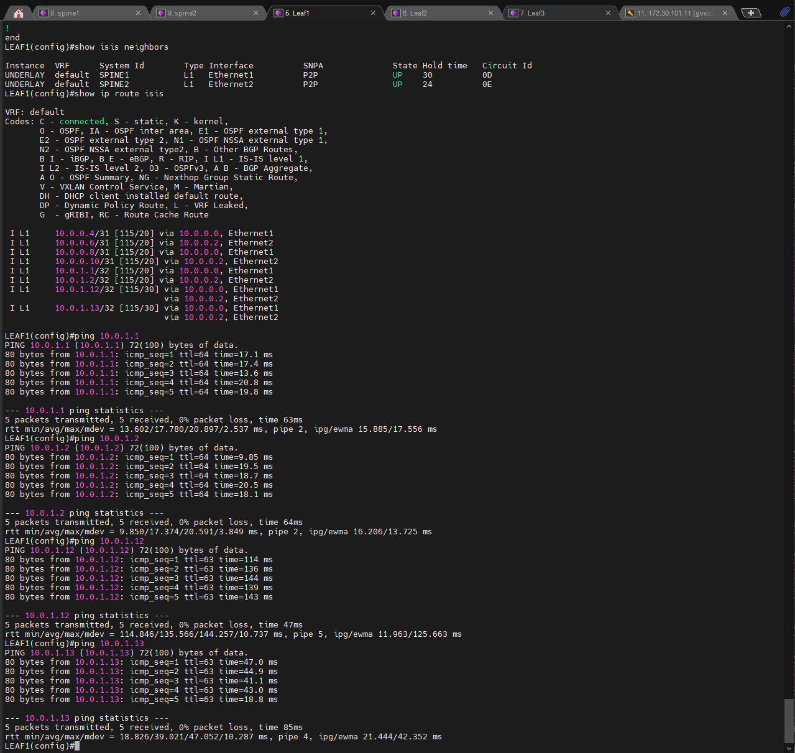
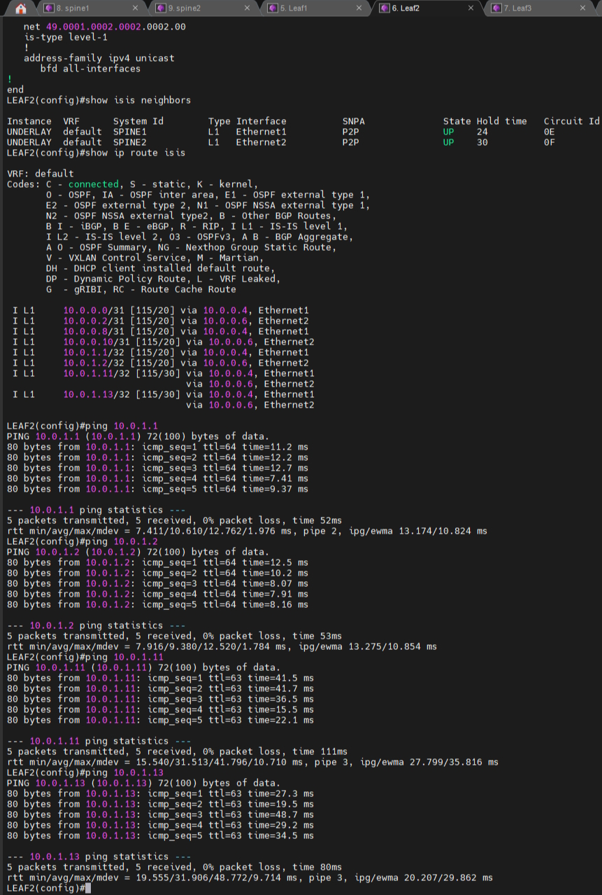
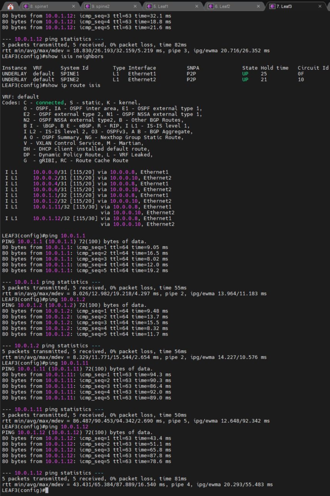

# Underlay. IS-IS

#### Цель:
Настроить  IS-IS для Underlay сети


#### Описание/Пошаговая инструкция выполнения домашнего задания:

В этой самостоятельной работе мы ожидаем, что вы самостоятельно:
1. Настроите ISIS в Underlay сети, для IP связанности между всеми сетевыми устройствами.
2. Зафиксируете в документации - план работы, адресное пространство, схему сети, конфигурацию устройств
3. Убедитесь в наличии IP связанности между устройствами в ISIS домене


### Адресное пространство 

Сеть DC 10.0.0.0/16

| Назначение            | CIDR              | Использование             |
| --------------------- | ----------------- | ------------------------- |
| Loopback устройств    | `10.0.1.0/24`     | Router-ID, BGP            |
| Underlay P2P          | `10.0.0.0/24`     | Spine ↔ Leaf              |
| VTEP/Overlay Loopback | `10.0.2.0/24`     | VXLAN VTEP                |
| Service               | `10.0.16.0/20`    | Клиентские/серверные сети |


## Таблицы IP адресов

| Device | Interface | IP             | Подключение |
| ------ | --------- | -------------- | ----------- |
| SPINE1 | Lo0       | `10.0.1.1/32`  | Router-ID   |
| SPINE1 | Eth1      | `10.0.0.0/31`  | LEAF1       |
| SPINE1 | Eth2      | `10.0.0.4/31`  | LEAF2       |
| SPINE1 | Eth3      | `10.0.0.8/31`  | LEAF3       |
| SPINE2 | Lo0       | `10.0.1.2/32`  | Router-ID   |
| SPINE2 | Eth1      | `10.0.0.6/31`  | LEAF2       |
| SPINE2 | Eth2      | `10.0.0.2/31`  | LEAF1       |
| SPINE2 | Eth3      | `10.0.0.10/31` | LEAF3       |
| LEAF1  | Lo0       | `10.0.1.11/32` | Router-ID   |
| LEAF1  | Eth1      | `10.0.0.1/31`  | SPINE1      |
| LEAF1  | Eth2      | `10.0.0.3/31`  | SPINE2      |
| LEAF2  | Lo0       | `10.0.1.12/32` | Router-ID   |
| LEAF2  | Eth1      | `10.0.0.5/31`  | SPINE1      |
| LEAF2  | Eth2      | `10.0.0.7/31`  | SPINE2      |
| LEAF3  | Lo0       | `10.0.1.13/32` | Router-ID   |
| LEAF3  | Eth1      | `10.0.0.9/31`  | SPINE1      |
| LEAF3  | Eth2      | `10.0.0.11/31` | SPINE2      |


## Итоговая схема



## План работы

1. Настровам ip адресацию на интерфейсах
2. Настраиваем протокол IS-IS, все маршрутзаторы будут находится в 49.0001
3. Проверяем связность

<details> 

<summary> Пример конфигурации SPINE1 </summary>

```
interface Ethernet1
   description P2P-to-LEAF1-Eth1
   no switchport
   ip address 10.0.0.0/31
   isis enable UNDERLAY
   isis network point-to-point
   isis authentication mode md5
   isis authentication key 7 uXRA74xJZP0=

interface Ethernet2
   description P2P-to-LEAF2-Eth1
   no switchport
   ip address 10.0.0.4/31
   isis enable UNDERLAY
   isis network point-to-point
   isis authentication mode md5
   isis authentication key 7 uXRA74xJZP0=

interface Ethernet3
   description P2P-to-LEAF3-Eth1
   no switchport
   ip address 10.0.0.8/31
   isis enable UNDERLAY
   isis network point-to-point
   isis authentication mode md5
   isis authentication key 7 uXRA74xJZP0=

interface Loopback0
   description Router-ID
   ip address 10.0.1.1/32
   isis enable UNDERLAY

router isis UNDERLAY
   net 49.0001.1111.1111.1111.00
   is-type level-1
   !
   address-family ipv4 unicast
      bfd all-interfaces


```
</details>


## Конфигураций

[Конфигурации](https://github.com/gvozd18/otus/blob/main/lab3/lab3.zip).

## Проверка связности

 





